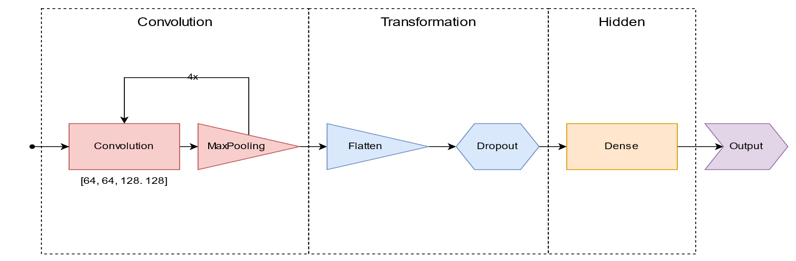

# Machine Learning
This repository contains the project of the lecture machine learning of the cooperative state university Stuttgart. The
goal is to develop a convolutional neural network (CNN) for image processing. In this project a data set with different
emotions of faces in the shape of 80x80 pixels will be trained. The data are from
<https://www.kaggle.com/datasets/kmirfan/micro-expressions>.

## File structure

```Text
|- archive: Old not updated prototype files (deprecated)
|- data: Contains the image data and the trained models
|- pictures: Screenshots of plots and models
convolutional-neural-network.ipynb: Notebook with the implementation of the model.
README.md: This readme file
```

## Model

The model has following components:


## Used technologies

- Python
- Tensorflow
- Matplotlib
- Jupyter Notebook